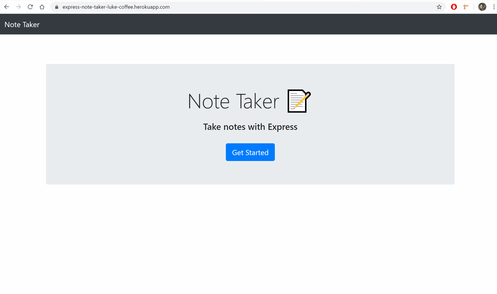

# Express_Note-Taker
This note taking application allows users to write, save, review, and delete notes with the push of a button. It makes use of express, node.js, html, and css.
## Getting Started
to try the application, you can visit the deployed site here
[ExpressNoteTakerDemoSite](https://express-note-taker-luke-coffee.herokuapp.com/)

### Installation
if you would like to run the application on your own machine:
-Clone this repo to your machine
-Navigate to the directory in CLI
-Enter "npm install" in the CLI, then wait for installation to finish
-Enter "node server.js" to establish a local server host - NOTE: DON'T CLOSE THE CLI 
-When you are done testing the app, press crtl+c in the CLI to terminate the localhost on your machine.
-In a browser, navigate to http://localhost:3000 to begin using the application

## DEMO

## Built With

* [HTML](https://developer.mozilla.org/en-US/docs/Web/HTML)
* [CSS](https://developer.mozilla.org/en-US/docs/Web/CSS)
* [Javascript](https://developer.mozilla.org/en-US/docs/Web/JavaScript)
* [Node.js](https://nodejs.org/en/)
* [NPM](https://www.npmjs.com/)

## Deployed Link

[ExpressNoteTakerDemoSite](https://express-note-taker-luke-coffee.herokuapp.com/)

## Authors

* Lucas Coffee

- [Link to Portfolio Site](https://kalashnikoffee.github.io/portfolio2/)
- [Link to Github](https://github.com/kalashnikoffee)
- [Link to LinkedIn](https://www.linkedin.com/in/lucas-coffee-08853719/)

See also the list of [contributors](https://github.com/your/project/contributors) who participated in this project.

## License

This project is licensed under the MIT License 

## Acknowledgments

Thanks again to Jerome, Kerwin, and Mahisha for their guidance.